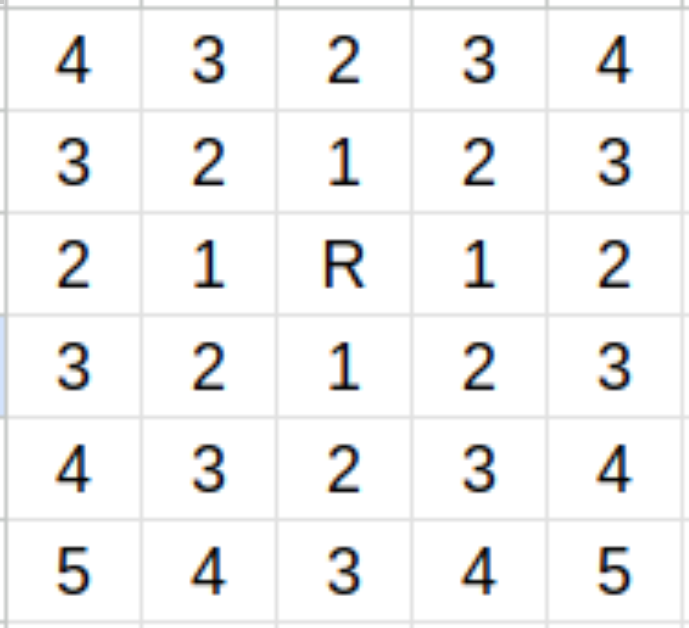
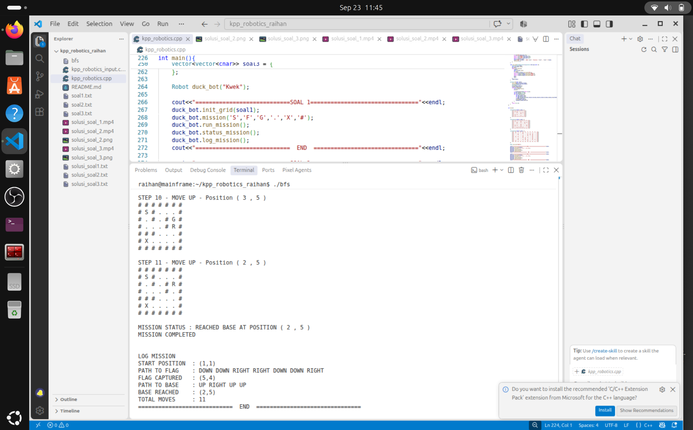
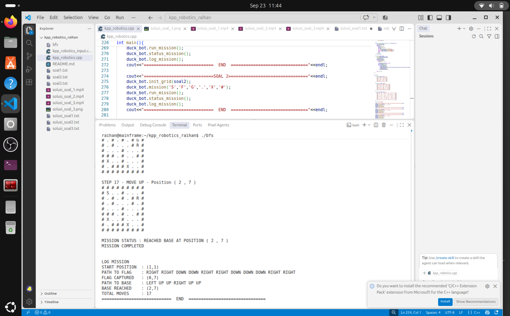
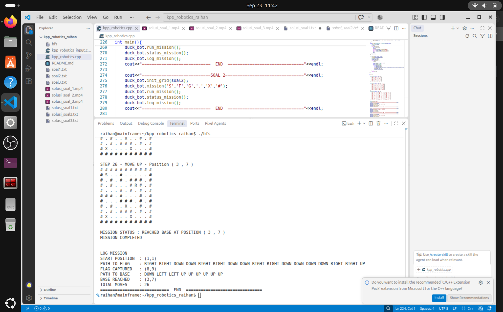

## KPP PELATDAS PROGRAMMING
Ditulis oleh M. Raihan Pratama (Duck Lover)
### Penjelasan File Program
Terdapat dua buah file source code program yang dapat dijalankan yakni `kpp_robotics.cpp` dan `kpp_robotics_input.cpp` kedua buah file sebenarnya adalah program yang sama, pembedanya hanyalah pada file `kpp_robotics.cpp` seluruh soal, yakni `soal1` `soal2` `soal3` sudah ditulis langsung didalam program sehingga program akan memberikan keluaran solusi untuk seluruh soal sekaligus, sedangkan pada file `kpp_robotics_input.cpp` soal diterima menggunakan masukan (berupa input file atau standar input) bukan di tulis langsung di dalam program, dengan format masukan :
```txt
soal
n m
c11 c12 c13 ... c1n
...
ci1 ci2 ci1 ... cin
...
cm1 cm2 cm3 ... cmn
```
Keterangan :
```txt
soal : nomor soal (int)
n    : banyak baris maze (int)
m    : banyak kolom maze (int)
cij  : Tile pada posisi baris ke-i dan kolom ke-j
       berupa salah satu dari 'S','F','G','.','X','#' (char)
```

Untuk menjalankan `kpp_robotics.cpp` ketik perintah berikut pada terminal :
```bash
g++ -o kpp_robotics kpp_robotics.cpp && ./kpp_robotics
```

Untuk menjalankan `kpp_robotics_input.cpp` ada dua cara berbeda :
1. Memasukan inputan menggunakan standar input, cukup jalankan perintah dibawah pada terminal :
   ```bash
   g++ -o kpp_robotics_input kpp_robotics_input.cpp && ./kpp_robotics_input
   ```
2. Masukan berupa file txt contoh masukan berupa `soal1.txt` :
   ```bash
   g++ -o kpp_robotics_input kpp_robotics_input.cpp && ./kpp_robotics_input < soal1.txt > solusi_soal1.txt
   ```
### Penjelesan Program 

Program memiliki tujuan untuk melakukan eksplorasi grid, dimulai dari titik start, mengambil bendera, lalu mencapai goal atau base.

> Untuk saat ini program hanya bisa melakukan eksplorasi untuk 1 start 1 flag dan 1 base saja :)

Pada kedua file sudah terdapat class Robot, dan kita hanya perlu menjalankan method yang ada didalam class tersebut.
```c++
Robot duck_bot("Kwek"); //Inisiasi Robot yang akan menjalankan misi
```
Sesuai dengan isi file mari kita sebut Robot yang melakukan eksplorasi adalah **DuckBot**, berikut tahapan yang akan dilakukan DuckBot dalam menyelasaikan misi:

- Pada awalnya DuckBot akan diberikan grid yang akan dieksplorasi.
  ```c++
  duck_bot.init_grid(grid); // Pastikan grid sudah tersedia berupa tipe data vector<vector<char>> grid;
  // vector dipilih sebab jauh lebih flexible
  //Anda tidak perlu khawatir, program akan otomatis untuk menyesuaikan dengan ukuran gridnya.
  ```
- Selanjutnya DuckBot akan diberikan mission yang akan dijalankan, dengan masukan berupa 6 buah karakter berbeda yang masing-masing menjelaskan tentang tile yang bermakna `START`,`FLAG`,`GOAL`,`PATH`,`LAND MINE`,`WALL`, hal ini diperlukan agar DuckBot paham makna sebuah karakter pada Grid, semisal jika ada karakter `LAND MINE` maka DuckBot tidak akan melewatinya.
  ```c++
  duck_bot.mission('S','F','G','.','X','#'); 
  // Start nya adalah S
  // Flag nya adalah F
  // Goal nya adalah G
  // Path nya adalah .
  // Landmine nya adalah X
  // Wall nya adalah #
  // Masukkan diberikan terurut
  ```
- Setelah itu DuckBot akan akan menjalankan misi dengan mula-mula mencari titik mulai (`START`) lalu mencoba menjelajahi grid dengan algoritma `BFS` sampai menemukan `FLAG`, kemudian dilanjutkan dengan menjelajahi grid sampai tiba di `GOAL` atau base.
  ```c++
  duck_bot.run_mission();
  ```
- Program di bawah sederhananya akan menampilkan terkait hasil eksplorasi yang dilakukan DuckBot `status_mission` akan menampilkan penjelajahan DuckBot berupa pergerakkan lengkap DuckBot di-dalam grid dari awal hingga sampai di-base, sedangkan `log_mission` akan menampilkan ringkasan eksplorasi hanya berupa serangkain arah pergerakkan DuckBot dari awal hingga akhir bukan simulasi pergerakkannya. 
  ```c++
  duck_bot.status_mission();
  duck_bot.log_mission();
  ```
Perhatikan bahwa program harus dijalankan terurut, logika sederhannya bagaimana DuckBot bisa mengkesplorasi sebuah grid sedangkan ia tidak tahu apa maksud tiap karakter pada grid, atau lebih parah bahkan belum ada gridnya, di full code sudah diterapkan program yang akan menghentikan proses jika ada program yang belum dijalankan.

### Algortima Eksplorasi
Algoritma yang digunakan pada program ini terbilang cukup sederhana yakni `BFS` atau Breadth First Search, sebuah algoritma penjelajahan dengan mengunjungi **seluruh tetangga** terdekat-nya terlebih dahulu hingga mencapai titik tertentu.

Dalam konteks grid **tetangga** disini adalah sebuah tile yang berada di atas, di bawah, di kiri, dan di kanan, dari posisi DuckBot (hanya bisa bergerak ke-empat arah), berikut contoh urutan penjelajahan (semakin dekat maka akan di-jelajahi terlebih dahulu):

> R akan menjelajahi semua tile 1 terlebih dahulu lalu semua tile 2, dan seterusnya. Dapat diimplementasikan dengan menggunakn tipe data queue.

> Dapat dilihat bahwa hasil pergerakan pada penjelajahan grid dengan algortima BFS pasti optimal !

**Mengapa memilih BFS?** alasan singkatnya adalah mudah diimplementasikan, penjelajahan optimal, dan sangat cepat untuk menjelajah grid pada soal kpp.

**Mengapa tidak DFS?** Penjelajahan tidak selalu optimal.

**Mengapa tidak Dijkstra?** Tiap tile memiliki weight 1 untuk bergerak dari tile sebelumnya, pada dasarnya ini adalah BFS tetapi menggunakan priority_queue, bisa dioptimalkan

**Mengapa tidak A star?** Overkill.

Berikut adalah fungsi BFS yang digunakan :
```c++
position bfs(char task){
        init_vis(grid_row,grid_column);
        init_pred(grid_row,grid_column);
        queue<position> q;
        q.push({pos_x,pos_y});
        vis[pos_x][pos_y]=1;
        while (!q.empty()){
            auto [x,y]=q.front();
            q.pop();

            if (grid[x][y]==task)return {x,y};
            int dir_x[4]={1,-1,0,0};
            int dir_y[4]={0,0,1,-1};
            for (int i=0;i<4;i++){
                int adj_x=x+dir_x[i];
                int adj_y=y+dir_y[i];
                if (adj_x<0||adj_y<0||adj_x>=grid_row||adj_y>=grid_column||vis[adj_x][adj_y]||grid[adj_x][adj_y]==bom||grid[adj_x][adj_y]==walls)continue;
                vis[adj_x][adj_y]=1;
                q.push({adj_x,adj_y});
                pred[adj_x][adj_y]={x,y};
            }
        }
        return {-1,-1};
    }
```

Terlihat sedikit terkutuk tapi inti kodenya adalah pergi ke-tile di empat arah berbeda jika belum dikunjungi atau bukan merupakan land mine, wall, dan keluar dari grid, dan simpan posisi tile sebelum menjelajahi tile sekarang.
> Kode bfsnya hanya 24 baris dari sekitar ~250 total baris kode.

Dan sebenarnya itu adalah inti utama dari program, sisa ~200 baris kode lain adalah untuk menampilkan keluaran penjelajahan yang terurut seperti yang diharapkan pada penugasan KPP.

### Hasil penjelajahan
#### **Soal 1**
```
# # # # # # #
# S # . . . #
# . # . # G #
# . . . # . #
# # # . . . #
# X . . F . #
# # # # # # #
```


#### **Soal 2**
```
# # # # # # # # #
# S . . # . . . #
# . # . # . # G #
# . # . . . # . #
# . . . # . . . #
# # # . # . . # #
# X . . # . . F #
# . # # # X . . #
# # # # # # # # #
```


#### **Soal 3**
```
# # # # # # # # # # #
# S . . # . . . . . #
# . # . # . # # # . #
# . # . . . # G # . #
# . . . # . # . # . #
# # # . # . . . # . #
# . . . # # # . # . #
# . # . . X . . # . #
# . # . # # # . # F #
# X . . . . X . . . #
# # # # # # # # # # #
```



Sayang sekali jika videonya tidak bisa diputar pada markdown, video tersebut adalah rekaman yang berasal dari program yang saya buat untuk menvisualkan arah pergerkan DuckBot agar lebih mudah diamati ketimbang mengamati keluarannya yang berupa teks, yang dikembangkan menggunakan pygame dengan bantuan ROS2 untuk komunikasi antara python dan c++.

!(kualitas video buruk sebab merupakan hasil dari penggabungan screenshot tiap frame pada program visualisasi menjadi sebuah video).

Source code program visualisasi kpp (belum sempurna) : https://github.com/mraihan14/kpp_robocon 